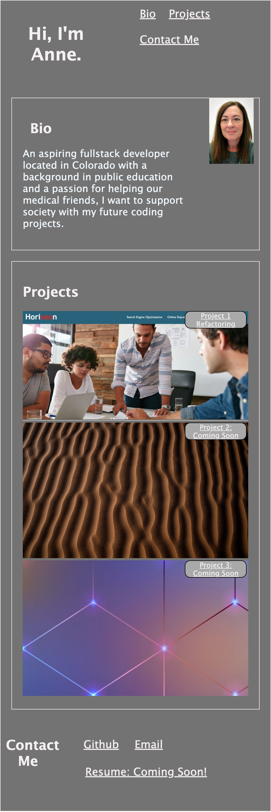

# Anne's Portfolio

## Description

This is the beginning level of a coding portfolio which includes semantic and responsive HTML and CSS components. As my learning continues, this portfolio will showcase more of my projects. 

A current photo is situated near the top. Links from the navigation connect to corresponding sections. The first project image is larger than the later ones. Project 1 has a link to the deployed Horiseon Refactoring page while Project 2 and 3 have the label of "Coming Soon."

The footer has live links to my email, Github respository, and a coming soon notation for my resume.

When resizing the page, several changes occur that adapt the viewport including flex-wrap and shrinking images. 

## Mock-up

The following screenshot shows the webpage's appearance:

Deployed Webpage:

[Portfolio](https://amccorkl.github.io/Portfolio/)

